# Linear Algebra for Deep Learning

## Table of Contents
1. [Introduction](#introduction)
2. [Vectors](#vectors)
   - Vector Addition
   - Dot Product with Visualizations
   - Cross Product (3D)
   - Vector Magnitude
   - Scalar Multiplication
3. [Matrices](#matrices)
   - Matrix Multiplication
   - Matrix Transpose
   - Determinant and Inverse (with Geometric Interpretation)
4. [Eigenvalues and Eigenvectors](#eigenvalues-and-eigenvectors)
   - Definition and Visualization
   - Eigenvalue Decomposition
5. [Linear Transformations](#linear-transformations)
   - Common Transformations
   - Matrix Rank
6. [Visualizations](#visualizations)
   - Vector Space
   - Linear Combinations
   - Orthogonal Vectors
   - Matrix Multiplication Step-by-Step
7. [Next Steps](#next-steps)
   - Image Processing Applications
   - Applied Projects

## Introduction

Linear algebra is the foundation of deep learning. Neural networks are essentially a series of matrix multiplications and transformations. Understanding vectors, matrices, and their operations is crucial for understanding how neural networks work.

**Mermaid Diagram: Linear Algebra in Neural Networks**

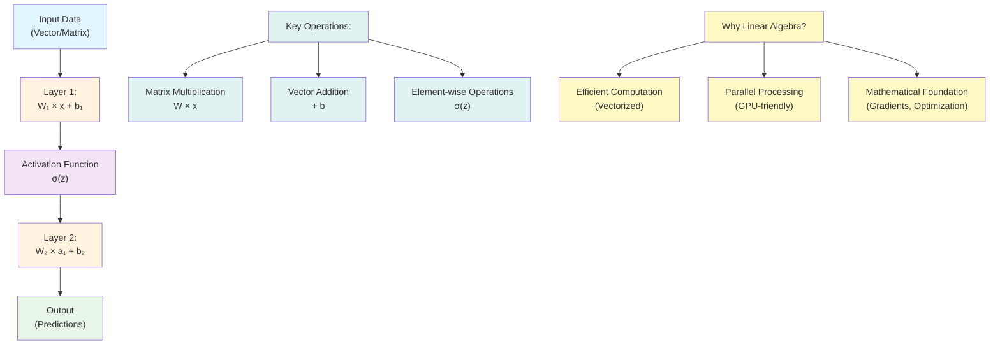

## Vectors

### What is a Vector?

A vector is an ordered collection of numbers. In deep learning, vectors represent:
- Input features
- Weights in neural networks
- Gradients during optimization
- Activations in layers

**Mermaid Diagram: Vector Representation**

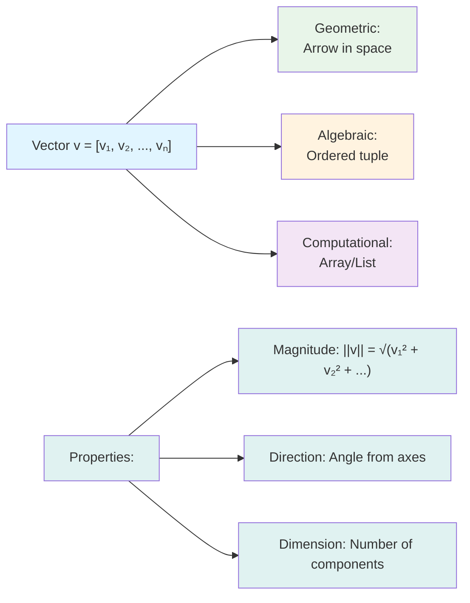

### Vector Operations

#### Vector Addition

**Mermaid Diagram: Vector Addition Process**

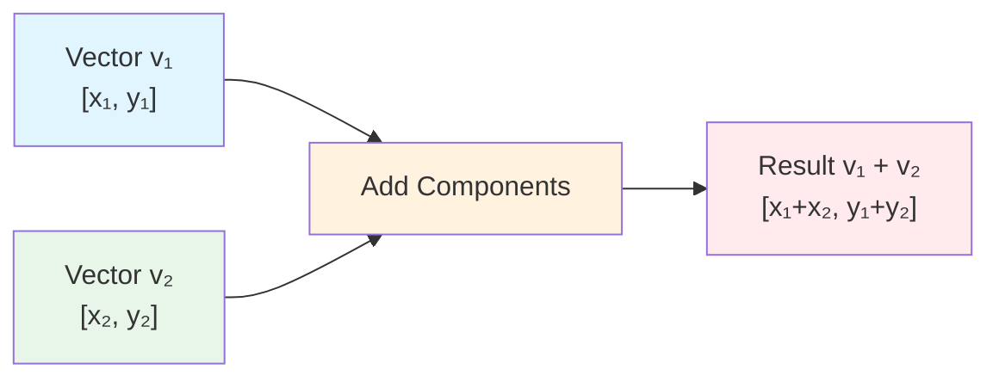

**Geometric Visualization:**

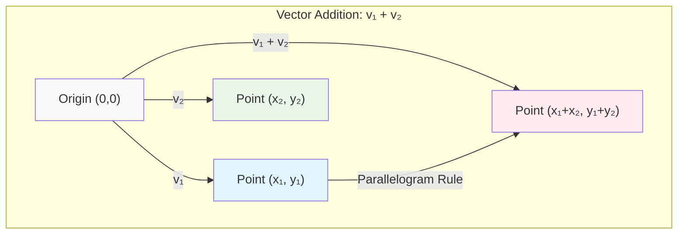

```python
import numpy as np
import matplotlib.pyplot as plt

# Create vectors
v1 = np.array([1, 2])
v2 = np.array([3, 1])

# Vector addition
v_sum = v1 + v2
print(f"v1 + v2 = {v_sum}")  # [4, 3]

# Visualize
fig, ax = plt.subplots(figsize=(8, 8))
ax.arrow(0, 0, v1[0], v1[1], head_width=0.1, head_length=0.1, 
         fc='blue', ec='blue', label='v1', linewidth=2)
ax.arrow(0, 0, v2[0], v2[1], head_width=0.1, head_length=0.1, 
         fc='green', ec='green', label='v2', linewidth=2)
ax.arrow(0, 0, v_sum[0], v_sum[1], head_width=0.1, head_length=0.1, 
         fc='red', ec='red', label='v1 + v2', linewidth=2)
ax.arrow(v1[0], v1[1], v2[0], v2[1], head_width=0.1, head_length=0.1, 
         fc='orange', ec='orange', linestyle='--', alpha=0.5, linewidth=1)

ax.set_xlim(-1, 5)
ax.set_ylim(-1, 5)
ax.set_xlabel('X', fontsize=12)
ax.set_ylabel('Y', fontsize=12)
ax.set_title('Vector Addition', fontsize=14, fontweight='bold')
ax.grid(True, alpha=0.3)
ax.axhline(y=0, color='k', linewidth=0.5)
ax.axvline(x=0, color='k', linewidth=0.5)
ax.legend(fontsize=10)
ax.set_aspect('equal')
plt.tight_layout()
plt.savefig('docs/images/vector_addition.png', dpi=150, bbox_inches='tight')
plt.show()
```

**Graph Explanation**: The red vector shows the result of adding v1 (blue) and v2 (green). The orange dashed line shows the parallelogram rule for vector addition.

#### Dot Product (Scalar Product)

The dot product measures how much two vectors point in the same direction.

**Mermaid Diagram: Dot Product Calculation**

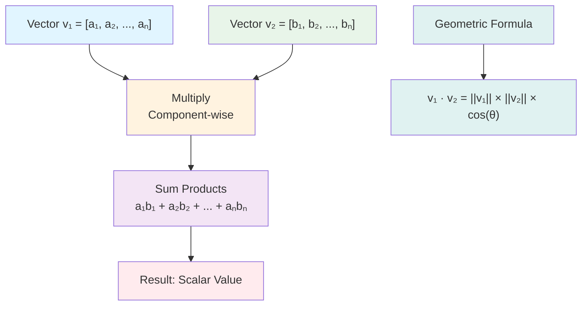

```python
# Dot product
v1 = np.array([1, 2, 3])
v2 = np.array([4, 5, 6])
dot_product = np.dot(v1, v2)
print(f"v1 · v2 = {dot_product}")  # 1*4 + 2*5 + 3*6 = 32

# Geometric interpretation: ||v1|| * ||v2|| * cos(θ)
magnitude_v1 = np.linalg.norm(v1)
magnitude_v2 = np.linalg.norm(v2)
cos_theta = dot_product / (magnitude_v1 * magnitude_v2)
angle_rad = np.arccos(cos_theta)
angle_deg = np.degrees(angle_rad)
print(f"Angle between vectors: {angle_deg:.2f} degrees")
```

**Visualization of Dot Product with Angle:**

```python
# Visualize dot product and angle between vectors
v1 = np.array([3, 2])
v2 = np.array([2, 3])

dot_product = np.dot(v1, v2)
magnitude_v1 = np.linalg.norm(v1)
magnitude_v2 = np.linalg.norm(v2)
angle_rad = np.arccos(dot_product / (magnitude_v1 * magnitude_v2))
angle_deg = np.degrees(angle_rad)

fig, axes = plt.subplots(1, 2, figsize=(14, 6))

# Vector visualization with angle
axes[0].arrow(0, 0, v1[0], v1[1], head_width=0.2, head_length=0.2,
             fc='blue', ec='blue', linewidth=3, label=f'v1 = {v1}')
axes[0].arrow(0, 0, v2[0], v2[1], head_width=0.2, head_length=0.2,
             fc='red', ec='red', linewidth=3, label=f'v2 = {v2}')

# Draw angle arc
theta = np.linspace(0, angle_rad, 100)
r = 0.8
axes[0].plot(r * np.cos(theta), r * np.sin(theta), 'g-', linewidth=2)
axes[0].text(0.5, 0.3, f'θ = {angle_deg:.1f}°', fontsize=12, 
            bbox=dict(boxstyle='round', facecolor='wheat', alpha=0.7))

axes[0].set_xlim(-1, 4)
axes[0].set_ylim(-1, 4)
axes[0].set_xlabel('X', fontsize=12)
axes[0].set_ylabel('Y', fontsize=12)
axes[0].set_title('Dot Product: Angle Between Vectors', fontsize=14, fontweight='bold')
axes[0].grid(True, alpha=0.3)
axes[0].axhline(y=0, color='k', linewidth=0.5)
axes[0].axvline(x=0, color='k', linewidth=0.5)
axes[0].legend(fontsize=10)
axes[0].set_aspect('equal')

# Projection visualization
proj_v2_on_v1 = (dot_product / (magnitude_v1**2)) * v1
axes[1].arrow(0, 0, v1[0], v1[1], head_width=0.2, head_length=0.2,
             fc='blue', ec='blue', linewidth=3, label='v1')
axes[1].arrow(0, 0, v2[0], v2[1], head_width=0.2, head_length=0.2,
             fc='red', ec='red', linewidth=2, alpha=0.7, label='v2')
axes[1].arrow(0, 0, proj_v2_on_v1[0], proj_v2_on_v1[1], 
             head_width=0.15, head_length=0.15,
             fc='green', ec='green', linewidth=2, linestyle='--',
             label=f'Projection of v2 on v1')
axes[1].plot([v2[0], proj_v2_on_v1[0]], [v2[1], proj_v2_on_v1[1]],
            'k--', linewidth=1, alpha=0.5)

axes[1].set_xlim(-1, 4)
axes[1].set_ylim(-1, 4)
axes[1].set_xlabel('X', fontsize=12)
axes[1].set_ylabel('Y', fontsize=12)
axes[1].set_title('Vector Projection', fontsize=14, fontweight='bold')
axes[1].grid(True, alpha=0.3)
axes[1].axhline(y=0, color='k', linewidth=0.5)
axes[1].axvline(x=0, color='k', linewidth=0.5)
axes[1].legend(fontsize=10)
axes[1].set_aspect('equal')

plt.tight_layout()
plt.savefig('docs/images/dot_product_visualization.png', dpi=150, bbox_inches='tight')
plt.show()

print(f"Dot product: v1 · v2 = {dot_product:.2f}")
print(f"Angle: {angle_deg:.2f} degrees")
print(f"Projection length: {np.linalg.norm(proj_v2_on_v1):.2f}")
```

#### Cross Product (3D only)

The cross product produces a vector perpendicular to both input vectors.

**Mermaid Diagram: Cross Product**

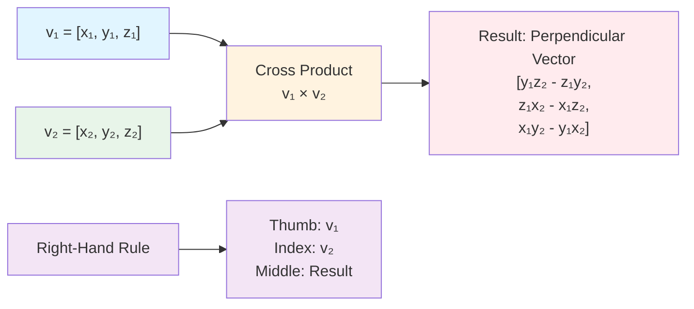

```python
# Cross product (perpendicular to both vectors)
v1 = np.array([1, 2, 3])
v2 = np.array([4, 5, 6])
cross_product = np.cross(v1, v2)
print(f"v1 × v2 = {cross_product}")  # [-3, 6, -3]
```

**3D Visualization of Cross Product:**

```python
from mpl_toolkits.mplot3d import Axes3D  # Required for 3D plots

# Create 3D vectors
v1 = np.array([2, 0, 0])
v2 = np.array([0, 2, 0])
cross_product = np.cross(v1, v2)

fig = plt.figure(figsize=(12, 10))
ax = fig.add_subplot(111, projection='3d')

# Draw vectors
ax.quiver(0, 0, 0, v1[0], v1[1], v1[2], color='blue', arrow_length_ratio=0.2, linewidth=3, label='v1')
ax.quiver(0, 0, 0, v2[0], v2[1], v2[2], color='red', arrow_length_ratio=0.2, linewidth=3, label='v2')
ax.quiver(0, 0, 0, cross_product[0], cross_product[1], cross_product[2], 
         color='green', arrow_length_ratio=0.2, linewidth=3, label='v1 × v2')

# Draw plane spanned by v1 and v2
xx, yy = np.meshgrid(np.linspace(-0.5, 2.5, 10), np.linspace(-0.5, 2.5, 10))
zz = np.zeros_like(xx)
ax.plot_surface(xx, yy, zz, alpha=0.2, color='yellow')

ax.set_xlabel('X', fontsize=12)
ax.set_ylabel('Y', fontsize=12)
ax.set_zlabel('Z', fontsize=12)
ax.set_title('Cross Product in 3D', fontsize=14, fontweight='bold')
ax.legend(fontsize=10)
ax.set_xlim([-1, 3])
ax.set_ylim([-1, 3])
ax.set_zlim([-1, 3])
plt.tight_layout()
plt.savefig('docs/images/cross_product_3d.png', dpi=150, bbox_inches='tight')
plt.show()
```

#### Vector Magnitude (Norm)

```python
# Vector magnitude visualization
v = np.array([3, 4])
magnitude = np.linalg.norm(v)

fig, ax = plt.subplots(figsize=(8, 8))
ax.arrow(0, 0, v[0], v[1], head_width=0.2, head_length=0.2,
         fc='blue', ec='blue', linewidth=3, label=f'v = {v}')

# Draw right triangle
ax.plot([0, v[0], v[0]], [0, 0, v[1]], 'r--', linewidth=1.5, alpha=0.7)
ax.plot([v[0], v[0]], [0, v[1]], 'r-', linewidth=2, label=f'Magnitude = {magnitude:.2f}')

# Annotations
ax.text(v[0]/2, -0.3, f'{v[0]}', fontsize=11, ha='center', fontweight='bold')
ax.text(v[0] + 0.2, v[1]/2, f'{v[1]}', fontsize=11, va='center', fontweight='bold')
ax.text(v[0]/2 + 0.2, v[1]/2 + 0.2, f'||v|| = √({v[0]}² + {v[1]}²) = {magnitude:.2f}', 
       fontsize=11, bbox=dict(boxstyle='round', facecolor='wheat', alpha=0.7))

ax.set_xlim(-0.5, 4)
ax.set_ylim(-0.5, 5)
ax.set_xlabel('X', fontsize=12)
ax.set_ylabel('Y', fontsize=12)
ax.set_title('Vector Magnitude (Norm)', fontsize=14, fontweight='bold')
ax.grid(True, alpha=0.3)
ax.axhline(y=0, color='k', linewidth=0.5)
ax.axvline(x=0, color='k', linewidth=0.5)
ax.legend(fontsize=10)
ax.set_aspect('equal')
plt.tight_layout()
plt.savefig('docs/images/vector_magnitude.png', dpi=150, bbox_inches='tight')
plt.show()
```

#### Scalar Multiplication

```python
# Scalar multiplication visualization
v = np.array([2, 1])
scalars = [0.5, 1, 2, -1]

fig, ax = plt.subplots(figsize=(10, 10))
colors = ['red', 'blue', 'green', 'orange']

for scalar, color in zip(scalars, colors):
    scaled_v = scalar * v
    ax.arrow(0, 0, scaled_v[0], scaled_v[1], head_width=0.15, head_length=0.15,
            fc=color, ec=color, linewidth=2, 
            label=f'{scalar} × v = {scaled_v}')

ax.set_xlim(-3, 5)
ax.set_ylim(-3, 3)
ax.set_xlabel('X', fontsize=12)
ax.set_ylabel('Y', fontsize=12)
ax.set_title('Scalar Multiplication', fontsize=14, fontweight='bold')
ax.grid(True, alpha=0.3)
ax.axhline(y=0, color='k', linewidth=0.5)
ax.axvline(x=0, color='k', linewidth=0.5)
ax.legend(fontsize=10)
ax.set_aspect('equal')
plt.tight_layout()
plt.savefig('docs/images/scalar_multiplication.png', dpi=150, bbox_inches='tight')
plt.show()
```

## Matrices

### What is a Matrix?

A matrix is a 2D array of numbers. In deep learning:
- Weight matrices connect layers
- Input data is often represented as matrices
- Transformations are matrix multiplications

**Mermaid Diagram: Matrix Structure**

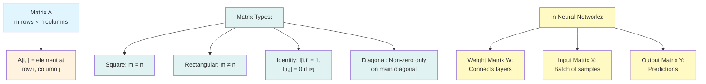

### Matrix Operations

#### Matrix Multiplication

Matrix multiplication is the core operation in neural networks. Each layer performs: `output = input × weights + bias`

**Mermaid Diagram: Matrix Multiplication Process**

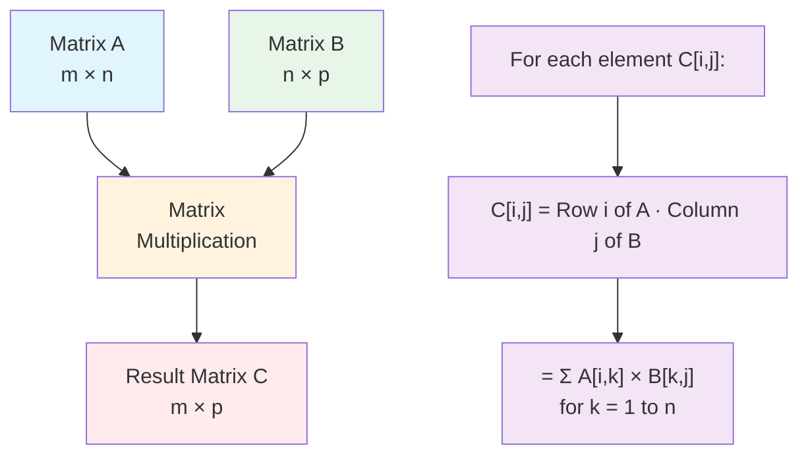

**Step-by-Step Matrix Multiplication:**

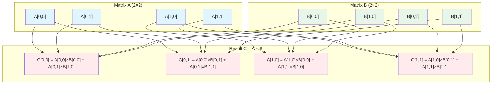

```python
# Matrix multiplication
A = np.array([[1, 2], [3, 4]])  # 2x2
B = np.array([[5, 6], [7, 8]])  # 2x2
C = np.dot(A, B)
print("Matrix A:")
print(A)
print("\nMatrix B:")
print(B)
print("\nA × B:")
print(C)

# Visualize matrix multiplication
fig, axes = plt.subplots(1, 3, figsize=(12, 4))

# Matrix A
im1 = axes[0].imshow(A, cmap='Blues', aspect='auto', vmin=0, vmax=10)
axes[0].set_title('Matrix A', fontsize=12, fontweight='bold')
axes[0].set_xticks([0, 1])
axes[0].set_yticks([0, 1])
axes[0].set_xticklabels(['1', '2'])
axes[0].set_yticklabels(['1', '2'])
for i in range(2):
    for j in range(2):
        axes[0].text(j, i, A[i, j], ha='center', va='center', 
                     fontsize=14, fontweight='bold', color='white')
plt.colorbar(im1, ax=axes[0])

# Matrix B
im2 = axes[1].imshow(B, cmap='Greens', aspect='auto', vmin=0, vmax=10)
axes[1].set_title('Matrix B', fontsize=12, fontweight='bold')
axes[1].set_xticks([0, 1])
axes[1].set_yticks([0, 1])
axes[1].set_xticklabels(['1', '2'])
axes[1].set_yticklabels(['1', '2'])
for i in range(2):
    for j in range(2):
        axes[1].text(j, i, B[i, j], ha='center', va='center', 
                     fontsize=14, fontweight='bold', color='white')
plt.colorbar(im2, ax=axes[1])

# Result C
im3 = axes[2].imshow(C, cmap='Reds', aspect='auto', vmin=0, vmax=50)
axes[2].set_title('A × B', fontsize=12, fontweight='bold')
axes[2].set_xticks([0, 1])
axes[2].set_yticks([0, 1])
axes[2].set_xticklabels(['1', '2'])
axes[2].set_yticklabels(['1', '2'])
for i in range(2):
    for j in range(2):
        axes[2].text(j, i, C[i, j], ha='center', va='center', 
                     fontsize=14, fontweight='bold', color='white')
plt.colorbar(im3, ax=axes[2])

plt.tight_layout()
plt.savefig('docs/images/matrix_multiplication.png', dpi=150, bbox_inches='tight')
plt.show()
```

**Key Insight**: In matrix multiplication `C = A × B`, element `C[i,j]` is the dot product of row `i` of A and column `j` of B.

#### Matrix Transpose

**Mermaid Diagram: Matrix Transpose Operation**

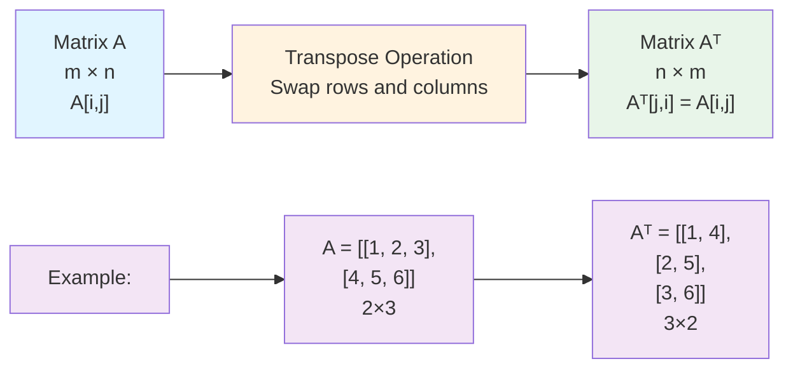

```python
A = np.array([[1, 2, 3], [4, 5, 6]])
A_transpose = A.T
print("Original Matrix A:")
print(A)
print("\nTranspose A^T:")
print(A_transpose)

# Visualize
fig, axes = plt.subplots(1, 2, figsize=(10, 4))
axes[0].imshow(A, cmap='Blues', aspect='auto')
axes[0].set_title('Matrix A (2×3)', fontsize=12, fontweight='bold')
for i in range(2):
    for j in range(3):
        axes[0].text(j, i, A[i, j], ha='center', va='center', 
                     fontsize=12, fontweight='bold', color='white')
axes[0].set_xticks(range(3))
axes[0].set_yticks(range(2))

axes[1].imshow(A_transpose, cmap='Greens', aspect='auto')
axes[1].set_title('A^T (3×2)', fontsize=12, fontweight='bold')
for i in range(3):
    for j in range(2):
        axes[1].text(j, i, A_transpose[i, j], ha='center', va='center', 
                     fontsize=12, fontweight='bold', color='white')
axes[1].set_xticks(range(2))
axes[1].set_yticks(range(3))

plt.tight_layout()
plt.savefig('docs/images/matrix_transpose.png', dpi=150, bbox_inches='tight')
plt.show()
```

#### Determinant and Inverse

The determinant measures how much a matrix scales area/volume. The inverse undoes the transformation.

**Mermaid Diagram: Determinant and Inverse**

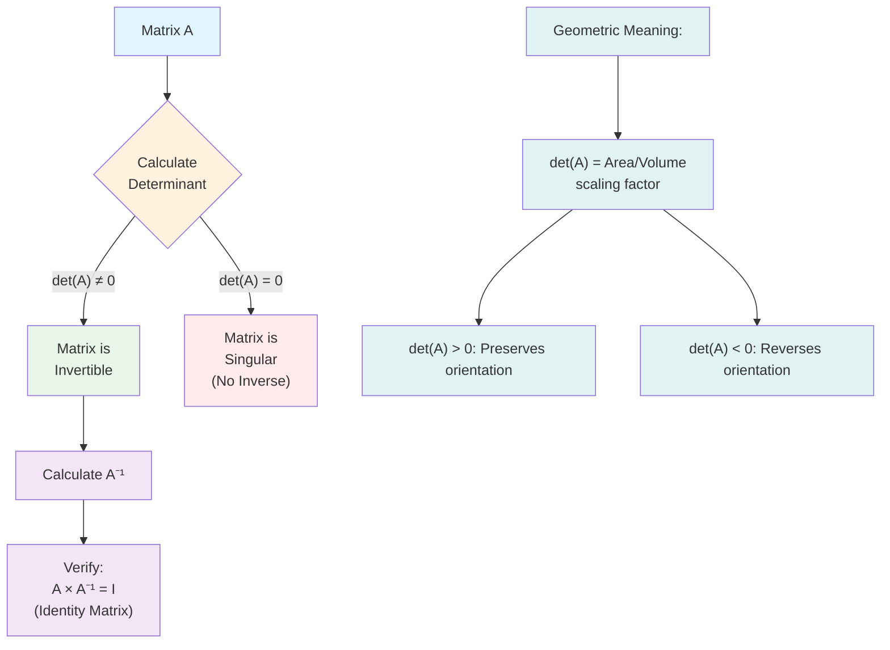

```python
A = np.array([[4, 2], [2, 3]])

# Determinant
det_A = np.linalg.det(A)
print(f"Determinant of A: {det_A:.2f}")

# Inverse (only if determinant ≠ 0)
if det_A != 0:
    A_inverse = np.linalg.inv(A)
    print("\nInverse of A:")
    print(A_inverse)
    
    # Verify: A × A^-1 = I (identity matrix)
    identity = np.dot(A, A_inverse)
    print("\nA × A^-1 (should be identity):")
    print(identity)
```

**Geometric Interpretation of Determinant:**

```python
# Visualize how determinant affects area
A1 = np.array([[2, 0], [0, 2]])  # Determinant = 4 (scales by 2x2)
A2 = np.array([[1, 1], [0, 1]])  # Determinant = 1 (shear, area preserved)
A3 = np.array([[0.5, 0], [0, 0.5]])  # Determinant = 0.25 (shrinks)

# Unit square
unit_square = np.array([[0, 1, 1, 0, 0], [0, 0, 1, 1, 0]])

fig, axes = plt.subplots(2, 2, figsize=(12, 12))

# Original unit square
axes[0, 0].plot(unit_square[0], unit_square[1], 'b-', linewidth=2, marker='o', markersize=6)
axes[0, 0].fill(unit_square[0], unit_square[1], alpha=0.3, color='blue')
axes[0, 0].set_title('Original Unit Square\nArea = 1', fontsize=12, fontweight='bold')
axes[0, 0].set_xlim(-0.5, 3)
axes[0, 0].set_ylim(-0.5, 3)
axes[0, 0].grid(True, alpha=0.3)
axes[0, 0].set_aspect('equal')

# Transformed by A1
transformed1 = A1 @ unit_square
det1 = np.linalg.det(A1)
axes[0, 1].plot(transformed1[0], transformed1[1], 'r-', linewidth=2, marker='o', markersize=6)
axes[0, 1].fill(transformed1[0], transformed1[1], alpha=0.3, color='red')
axes[0, 1].set_title(f'After A1 (Scaling)\nDet = {det1:.2f}, Area = {det1:.2f}', 
                   fontsize=12, fontweight='bold')
axes[0, 1].set_xlim(-0.5, 3)
axes[0, 1].set_ylim(-0.5, 3)
axes[0, 1].grid(True, alpha=0.3)
axes[0, 1].set_aspect('equal')

# Transformed by A2
transformed2 = A2 @ unit_square
det2 = np.linalg.det(A2)
axes[1, 0].plot(transformed2[0], transformed2[1], 'g-', linewidth=2, marker='o', markersize=6)
axes[1, 0].fill(transformed2[0], transformed2[1], alpha=0.3, color='green')
axes[1, 0].set_title(f'After A2 (Shear)\nDet = {det2:.2f}, Area = {det2:.2f}', 
                   fontsize=12, fontweight='bold')
axes[1, 0].set_xlim(-0.5, 3)
axes[1, 0].set_ylim(-0.5, 3)
axes[1, 0].grid(True, alpha=0.3)
axes[1, 0].set_aspect('equal')

# Transformed by A3
transformed3 = A3 @ unit_square
det3 = np.linalg.det(A3)
axes[1, 1].plot(transformed3[0], transformed3[1], 'orange', linewidth=2, marker='o', markersize=6)
axes[1, 1].fill(transformed3[0], transformed3[1], alpha=0.3, color='orange')
axes[1, 1].set_title(f'After A3 (Shrink)\nDet = {det3:.2f}, Area = {det3:.2f}', 
                   fontsize=12, fontweight='bold')
axes[1, 1].set_xlim(-0.5, 3)
axes[1, 1].set_ylim(-0.5, 3)
axes[1, 1].grid(True, alpha=0.3)
axes[1, 1].set_aspect('equal')

plt.tight_layout()
plt.savefig('docs/images/determinant_geometric.png', dpi=150, bbox_inches='tight')
plt.show()
```

**Matrix Inverse Visualization:**

```python
# Visualize matrix and its inverse
A = np.array([[2, 1], [1, 2]])
A_inv = np.linalg.inv(A)

# Test vector
v = np.array([1, 1])

# Transformations
v_transformed = A @ v
v_restored = A_inv @ v_transformed

fig, axes = plt.subplots(1, 3, figsize=(15, 5))

# Original
axes[0].arrow(0, 0, v[0], v[1], head_width=0.15, head_length=0.15,
            fc='blue', ec='blue', linewidth=3, label='Original v')
axes[0].set_title('Original Vector v', fontsize=12, fontweight='bold')
axes[0].set_xlim(-1, 4)
axes[0].set_ylim(-1, 4)
axes[0].grid(True, alpha=0.3)
axes[0].set_aspect('equal')
axes[0].legend(fontsize=9)

# After A
axes[1].arrow(0, 0, v_transformed[0], v_transformed[1], 
            head_width=0.15, head_length=0.15,
            fc='red', ec='red', linewidth=3, label='A × v')
axes[1].set_title('After Transformation A', fontsize=12, fontweight='bold')
axes[1].set_xlim(-1, 4)
axes[1].set_ylim(-1, 4)
axes[1].grid(True, alpha=0.3)
axes[1].set_aspect('equal')
axes[1].legend(fontsize=9)

# After A^-1 (restored)
axes[2].arrow(0, 0, v_restored[0], v_restored[1], 
            head_width=0.15, head_length=0.15,
            fc='green', ec='green', linewidth=3, label='A⁻¹ × (A × v)')
axes[2].arrow(0, 0, v[0], v[1], head_width=0.1, head_length=0.1,
            fc='blue', ec='blue', linewidth=2, linestyle='--', alpha=0.5, label='Original v')
axes[2].set_title('After Inverse A⁻¹ (Restored)', fontsize=12, fontweight='bold')
axes[2].set_xlim(-1, 4)
axes[2].set_ylim(-1, 4)
axes[2].grid(True, alpha=0.3)
axes[2].set_aspect('equal')
axes[2].legend(fontsize=9)

plt.tight_layout()
plt.savefig('docs/images/matrix_inverse.png', dpi=150, bbox_inches='tight')
plt.show()
```

## Eigenvalues and Eigenvectors

Eigenvalues and eigenvectors are crucial in:
- Principal Component Analysis (PCA)
- Understanding neural network dynamics
- Matrix decomposition

### Definition

For a matrix A, if `Av = λv` where:
- `v` is an eigenvector (non-zero vector)
- `λ` is an eigenvalue (scalar)

Then `v` is an eigenvector with eigenvalue `λ`.

**Mermaid Diagram: Eigenvalue and Eigenvector Relationship**

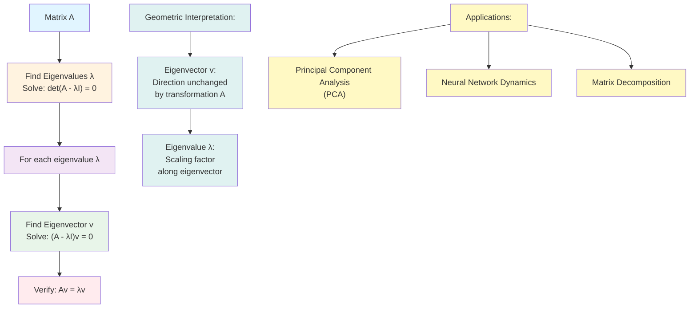

```python
# Find eigenvalues and eigenvectors
A = np.array([[4, 2], [2, 3]])
eigenvalues, eigenvectors = np.linalg.eig(A)

print("Matrix A:")
print(A)
print(f"\nEigenvalues: {eigenvalues}")
print(f"\nEigenvectors (columns):")
print(eigenvectors)

# Visualize eigenvectors
fig, ax = plt.subplots(figsize=(10, 10))

# Original vectors
for i in range(2):
    vec = eigenvectors[:, i]
    eigenval = eigenvalues[i]
    
    # Original vector
    ax.arrow(0, 0, vec[0], vec[1], head_width=0.15, head_length=0.15,
             fc='blue', ec='blue', linewidth=2, label=f'Eigenvector {i+1}')
    
    # Transformed vector (should be parallel)
    transformed = np.dot(A, vec)
    ax.arrow(0, 0, transformed[0], transformed[1], 
             head_width=0.15, head_length=0.15,
             fc='red', ec='red', linewidth=2, linestyle='--',
             label=f'A×v{i+1} (λ={eigenval:.2f})')
    
    # Verify: transformed should be eigenvalue * original
    scaled = eigenval * vec
    ax.arrow(0, 0, scaled[0], scaled[1], 
             head_width=0.1, head_length=0.1,
             fc='green', ec='green', linewidth=1.5, linestyle=':',
             alpha=0.7)

ax.set_xlim(-6, 6)
ax.set_ylim(-6, 6)
ax.set_xlabel('X', fontsize=12)
ax.set_ylabel('Y', fontsize=12)
ax.set_title('Eigenvectors and Their Transformations', fontsize=14, fontweight='bold')
ax.grid(True, alpha=0.3)
ax.axhline(y=0, color='k', linewidth=0.5)
ax.axvline(x=0, color='k', linewidth=0.5)
ax.legend(fontsize=9)
ax.set_aspect('equal')
plt.tight_layout()
plt.savefig('docs/images/eigenvectors.png', dpi=150, bbox_inches='tight')
plt.show()
```

**Key Insight**: When a matrix multiplies its eigenvector, the result is just a scaled version of the eigenvector (scaled by the eigenvalue).

**Eigenvalue Decomposition Visualization:**

```python
# Visualize eigenvalue decomposition
A = np.array([[3, 1], [1, 3]])
eigenvalues, eigenvectors = np.linalg.eig(A)

# Create a circle of vectors
theta = np.linspace(0, 2*np.pi, 100)
circle_vectors = np.array([np.cos(theta), np.sin(theta)])

# Transform circle by matrix A
transformed_circle = A @ circle_vectors

fig, axes = plt.subplots(1, 2, figsize=(14, 6))

# Original circle
axes[0].plot(circle_vectors[0], circle_vectors[1], 'b-', linewidth=2, label='Unit Circle')
axes[0].set_title('Original Unit Circle', fontsize=12, fontweight='bold')
axes[0].set_xlabel('X', fontsize=11)
axes[0].set_ylabel('Y', fontsize=11)
axes[0].grid(True, alpha=0.3)
axes[0].set_aspect('equal')
axes[0].legend(fontsize=9)

# Transformed ellipse
axes[1].plot(transformed_circle[0], transformed_circle[1], 'r-', linewidth=2, label='Transformed Ellipse')

# Draw eigenvectors
for i, (eigenval, eigenvec) in enumerate(zip(eigenvalues, eigenvectors.T)):
    # Scale eigenvector by eigenvalue
    scaled = eigenval * eigenvec
    axes[1].arrow(0, 0, scaled[0], scaled[1], head_width=0.2, head_length=0.2,
                 fc=['blue', 'green'][i], ec=['blue', 'green'][i], linewidth=2,
                 label=f'Eigenvector {i+1} (λ={eigenval:.2f})')

axes[1].set_title('After Transformation by A', fontsize=12, fontweight='bold')
axes[1].set_xlabel('X', fontsize=11)
axes[1].set_ylabel('Y', fontsize=11)
axes[1].grid(True, alpha=0.3)
axes[1].set_aspect('equal')
axes[1].legend(fontsize=9)

plt.tight_layout()
plt.savefig('docs/images/eigenvalue_decomposition.png', dpi=150, bbox_inches='tight')
plt.show()
```

## Linear Transformations

**Mermaid Diagram: Types of Linear Transformations**

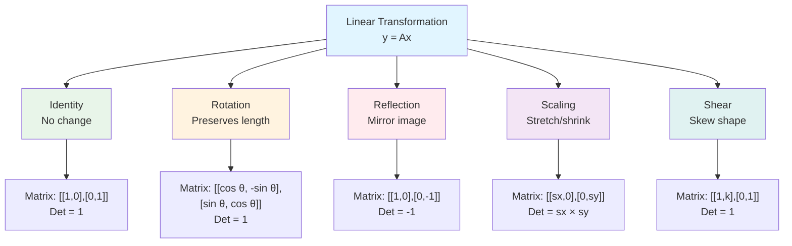

### Common Matrix Transformations

```python
# Visualize common linear transformations
unit_square = np.array([[0, 1, 1, 0, 0], [0, 0, 1, 1, 0]])

transformations = {
    'Identity': np.array([[1, 0], [0, 1]]),
    'Rotation 90°': np.array([[0, -1], [1, 0]]),
    'Reflection (y=x)': np.array([[0, 1], [1, 0]]),
    'Scaling': np.array([[2, 0], [0, 0.5]]),
    'Shear': np.array([[1, 1], [0, 1]])
}

fig, axes = plt.subplots(2, 3, figsize=(15, 10))
axes = axes.flatten()

# Original
axes[0].plot(unit_square[0], unit_square[1], 'b-', linewidth=2, marker='o', markersize=4)
axes[0].fill(unit_square[0], unit_square[1], alpha=0.3, color='blue')
axes[0].set_title('Original Unit Square', fontsize=11, fontweight='bold')
axes[0].set_xlim(-2, 3)
axes[0].set_ylim(-2, 3)
axes[0].grid(True, alpha=0.3)
axes[0].set_aspect('equal')

# Apply each transformation
for idx, (name, T) in enumerate(transformations.items(), 1):
    transformed = T @ unit_square
    axes[idx].plot(transformed[0], transformed[1], 'r-', linewidth=2, marker='o', markersize=4)
    axes[idx].fill(transformed[0], transformed[1], alpha=0.3, color='red')
    axes[idx].set_title(f'{name}\nDet = {np.linalg.det(T):.2f}', fontsize=11, fontweight='bold')
    axes[idx].set_xlim(-2, 3)
    axes[idx].set_ylim(-2, 3)
    axes[idx].grid(True, alpha=0.3)
    axes[idx].set_aspect('equal')

plt.tight_layout()
plt.savefig('docs/images/linear_transformations.png', dpi=150, bbox_inches='tight')
plt.show()
```

**Mermaid Diagram: Matrix Rank Concept**

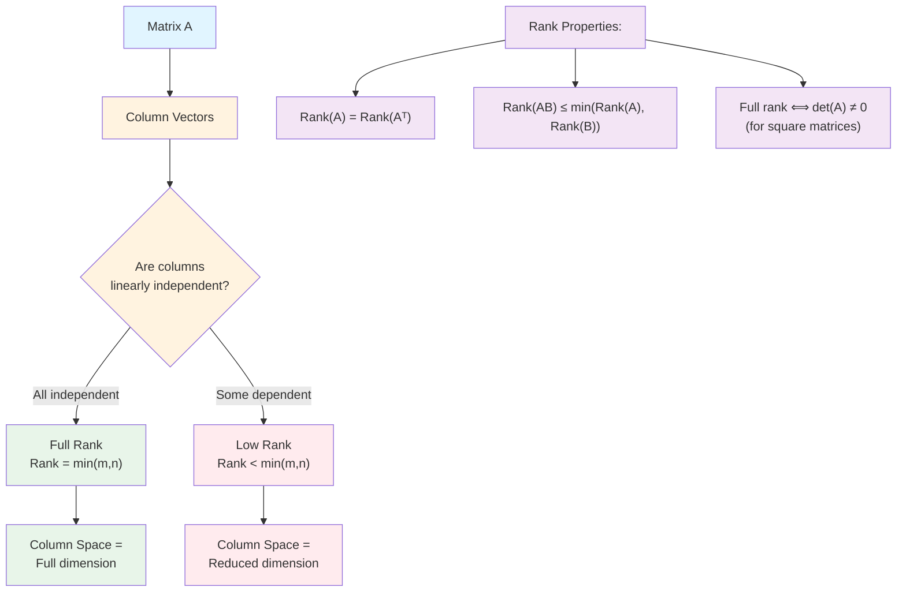

### Matrix Rank Visualization

```python
# Visualize matrix rank (dimensionality of column space)
A_full_rank = np.array([[2, 1], [1, 2]])  # Rank 2
A_low_rank = np.array([[2, 4], [1, 2]])   # Rank 1 (columns are linearly dependent)

# Column vectors
col1_full = A_full_rank[:, 0]
col2_full = A_full_rank[:, 1]
col1_low = A_low_rank[:, 0]
col2_low = A_low_rank[:, 1]

fig, axes = plt.subplots(1, 2, figsize=(14, 6))

# Full rank
axes[0].arrow(0, 0, col1_full[0], col1_full[1], head_width=0.2, head_length=0.2,
            fc='blue', ec='blue', linewidth=2, label='Column 1')
axes[0].arrow(0, 0, col2_full[0], col2_full[1], head_width=0.2, head_length=0.2,
            fc='red', ec='red', linewidth=2, label='Column 2')
axes[0].set_title(f'Full Rank Matrix (Rank = 2)\nColumns are independent', 
                 fontsize=12, fontweight='bold')
axes[0].set_xlim(-1, 3)
axes[0].set_ylim(-1, 3)
axes[0].grid(True, alpha=0.3)
axes[0].legend(fontsize=9)
axes[0].set_aspect('equal')

# Low rank
axes[1].arrow(0, 0, col1_low[0], col1_low[1], head_width=0.2, head_length=0.2,
            fc='blue', ec='blue', linewidth=2, label='Column 1')
axes[1].arrow(0, 0, col2_low[0], col2_low[1], head_width=0.2, head_length=0.2,
            fc='red', ec='red', linewidth=2, label='Column 2 (2×Col1)')
axes[1].set_title(f'Low Rank Matrix (Rank = 1)\nColumns are dependent', 
                 fontsize=12, fontweight='bold')
axes[1].set_xlim(-1, 5)
axes[1].set_ylim(-1, 3)
axes[1].grid(True, alpha=0.3)
axes[1].legend(fontsize=9)
axes[1].set_aspect('equal')

plt.tight_layout()
plt.savefig('docs/images/matrix_rank.png', dpi=150, bbox_inches='tight')
plt.show()
```

## Visualizations

### Vector Space Visualization

```python
# Create a 2D vector space
fig, ax = plt.subplots(figsize=(10, 10))

# Basis vectors
e1 = np.array([1, 0])
e2 = np.array([0, 1])

# Some vectors
vectors = [
    np.array([2, 1]),
    np.array([-1, 2]),
    np.array([3, -1]),
    np.array([-2, -2])
]

colors = ['blue', 'green', 'red', 'orange']
labels = ['v1', 'v2', 'v3', 'v4']

for vec, color, label in zip(vectors, colors, labels):
    ax.arrow(0, 0, vec[0], vec[1], head_width=0.2, head_length=0.2,
             fc=color, ec=color, linewidth=2, label=label)
    ax.text(vec[0]*1.1, vec[1]*1.1, label, fontsize=11, fontweight='bold')

# Basis vectors
ax.arrow(0, 0, e1[0], e1[1], head_width=0.15, head_length=0.15,
         fc='black', ec='black', linewidth=2, linestyle='--', alpha=0.5)
ax.arrow(0, 0, e2[0], e2[1], head_width=0.15, head_length=0.15,
         fc='black', ec='black', linewidth=2, linestyle='--', alpha=0.5)
ax.text(1.1, 0, 'e1', fontsize=10, style='italic')
ax.text(0, 1.1, 'e2', fontsize=10, style='italic')

ax.set_xlim(-4, 4)
ax.set_ylim(-4, 4)
ax.set_xlabel('X', fontsize=12)
ax.set_ylabel('Y', fontsize=12)
ax.set_title('2D Vector Space', fontsize=14, fontweight='bold')
ax.grid(True, alpha=0.3)
ax.axhline(y=0, color='k', linewidth=0.5)
ax.axvline(x=0, color='k', linewidth=0.5)
ax.legend(fontsize=10)
ax.set_aspect('equal')
plt.tight_layout()
plt.savefig('docs/images/vector_space.png', dpi=150, bbox_inches='tight')
plt.show()
```

**Mermaid Diagram: Linear Combination Concept**

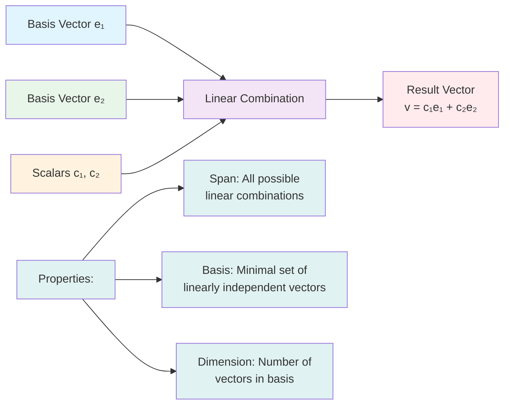

### Linear Combinations

```python
# Visualize linear combinations of basis vectors
e1 = np.array([1, 0])
e2 = np.array([0, 1])

# Different linear combinations
combinations = [
    (2, 1, '2e₁ + e₂'),
    (1, 2, 'e₁ + 2e₂'),
    (-1, 1, '-e₁ + e₂'),
    (1, -1, 'e₁ - e₂')
]

fig, axes = plt.subplots(2, 2, figsize=(12, 12))
axes = axes.flatten()

for idx, (c1, c2, label) in enumerate(combinations):
    result = c1 * e1 + c2 * e2
    
    # Basis vectors
    axes[idx].arrow(0, 0, e1[0], e1[1], head_width=0.15, head_length=0.15,
                   fc='blue', ec='blue', linewidth=2, alpha=0.5, label='e₁')
    axes[idx].arrow(0, 0, e2[0], e2[1], head_width=0.15, head_length=0.15,
                   fc='green', ec='green', linewidth=2, alpha=0.5, label='e₂')
    
    # Scaled basis vectors
    axes[idx].arrow(0, 0, c1*e1[0], c1*e1[1], head_width=0.1, head_length=0.1,
                   fc='blue', ec='blue', linewidth=1.5, linestyle='--', alpha=0.7)
    axes[idx].arrow(c1*e1[0], c1*e1[1], c2*e2[0], c2*e2[1], 
                   head_width=0.1, head_length=0.1,
                   fc='green', ec='green', linewidth=1.5, linestyle='--', alpha=0.7)
    
    # Result
    axes[idx].arrow(0, 0, result[0], result[1], head_width=0.2, head_length=0.2,
                   fc='red', ec='red', linewidth=3, label=label)
    
    axes[idx].set_xlim(-2, 3)
    axes[idx].set_ylim(-2, 3)
    axes[idx].set_title(label, fontsize=11, fontweight='bold')
    axes[idx].grid(True, alpha=0.3)
    axes[idx].axhline(y=0, color='k', linewidth=0.5)
    axes[idx].axvline(x=0, color='k', linewidth=0.5)
    axes[idx].legend(fontsize=8)
    axes[idx].set_aspect('equal')

plt.tight_layout()
plt.savefig('docs/images/linear_combinations.png', dpi=150, bbox_inches='tight')
plt.show()
```

**Mermaid Diagram: Orthogonality and Orthonormality**

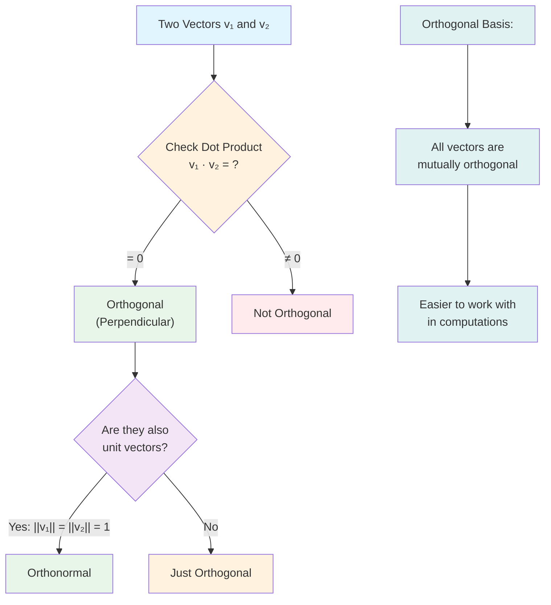

### Orthogonal Vectors

```python
# Visualize orthogonal (perpendicular) vectors
v1 = np.array([3, 0])
v2 = np.array([0, 2])

# Check orthogonality
dot_product = np.dot(v1, v2)
is_orthogonal = abs(dot_product) < 1e-10

fig, ax = plt.subplots(figsize=(8, 8))

ax.arrow(0, 0, v1[0], v1[1], head_width=0.2, head_length=0.2,
        fc='blue', ec='blue', linewidth=3, label=f'v1 = {v1}')
ax.arrow(0, 0, v2[0], v2[1], head_width=0.2, head_length=0.2,
        fc='red', ec='red', linewidth=3, label=f'v2 = {v2}')

# Draw right angle indicator
ax.plot([0.3, 0.3, 0], [0, 0.2, 0.2], 'k-', linewidth=1.5)

ax.set_xlim(-1, 4)
ax.set_ylim(-1, 3)
ax.set_xlabel('X', fontsize=12)
ax.set_ylabel('Y', fontsize=12)
ax.set_title(f'Orthogonal Vectors\nv1 · v2 = {dot_product} (should be 0)', 
            fontsize=14, fontweight='bold')
ax.grid(True, alpha=0.3)
ax.axhline(y=0, color='k', linewidth=0.5)
ax.axvline(x=0, color='k', linewidth=0.5)
ax.legend(fontsize=10)
ax.set_aspect('equal')
plt.tight_layout()
plt.savefig('docs/images/orthogonal_vectors.png', dpi=150, bbox_inches='tight')
plt.show()
```

### Matrix Multiplication Step-by-Step

```python
# Detailed visualization of matrix multiplication
A = np.array([[1, 2], [3, 4]])
B = np.array([[5, 6], [7, 8]])
C = A @ B

fig = plt.figure(figsize=(16, 10))

# Create a detailed visualization
gs = fig.add_gridspec(3, 4, hspace=0.3, wspace=0.3)

# Matrix A
ax1 = fig.add_subplot(gs[0, 0])
im1 = ax1.imshow(A, cmap='Blues', aspect='auto', vmin=0, vmax=10)
ax1.set_title('Matrix A', fontsize=12, fontweight='bold')
for i in range(2):
    for j in range(2):
        ax1.text(j, i, A[i, j], ha='center', va='center', fontsize=14, 
                fontweight='bold', color='white')
ax1.set_xticks([0, 1])
ax1.set_yticks([0, 1])
ax1.set_xticklabels(['Col 1', 'Col 2'])
ax1.set_yticklabels(['Row 1', 'Row 2'])

# Matrix B
ax2 = fig.add_subplot(gs[0, 1])
im2 = ax2.imshow(B, cmap='Greens', aspect='auto', vmin=0, vmax=10)
ax2.set_title('Matrix B', fontsize=12, fontweight='bold')
for i in range(2):
    for j in range(2):
        ax2.text(j, i, B[i, j], ha='center', va='center', fontsize=14, 
                fontweight='bold', color='white')
ax2.set_xticks([0, 1])
ax2.set_yticks([0, 1])
ax2.set_xticklabels(['Col 1', 'Col 2'])
ax2.set_yticklabels(['Row 1', 'Row 2'])

# Result C
ax3 = fig.add_subplot(gs[0, 2:])
im3 = ax3.imshow(C, cmap='Reds', aspect='auto', vmin=0, vmax=50)
ax3.set_title('Result: A × B', fontsize=12, fontweight='bold')
for i in range(2):
    for j in range(2):
        ax3.text(j, i, C[i, j], ha='center', va='center', fontsize=14, 
                fontweight='bold', color='white')
ax3.set_xticks([0, 1])
ax3.set_yticks([0, 1])
ax3.set_xticklabels(['Col 1', 'Col 2'])
ax3.set_yticklabels(['Row 1', 'Row 2'])

# Step-by-step calculations
ax4 = fig.add_subplot(gs[1:, :])
ax4.axis('off')
calculation_text = f"""
Matrix Multiplication Step-by-Step:

C[0,0] = A[0,:] · B[:,0] = [{A[0,0]}, {A[0,1]}] · [{B[0,0]}, {B[1,0]}] = {A[0,0]}×{B[0,0]} + {A[0,1]}×{B[1,0]} = {C[0,0]}

C[0,1] = A[0,:] · B[:,1] = [{A[0,0]}, {A[0,1]}] · [{B[0,1]}, {B[1,1]}] = {A[0,0]}×{B[0,1]} + {A[0,1]}×{B[1,1]} = {C[0,1]}

C[1,0] = A[1,:] · B[:,0] = [{A[1,0]}, {A[1,1]}] · [{B[0,0]}, {B[1,0]}] = {A[1,0]}×{B[0,0]} + {A[1,1]}×{B[1,0]} = {C[1,0]}

C[1,1] = A[1,:] · B[:,1] = [{A[1,0]}, {A[1,1]}] · [{B[0,1]}, {B[1,1]}] = {A[1,0]}×{B[0,1]} + {A[1,1]}×{B[1,1]} = {C[1,1]}

Key: Each element C[i,j] is the dot product of row i of A and column j of B
"""
ax4.text(0.1, 0.5, calculation_text, fontsize=11, family='monospace',
        verticalalignment='center', bbox=dict(boxstyle='round', facecolor='wheat', alpha=0.7))

plt.savefig('docs/images/matrix_multiplication_detailed.png', dpi=150, bbox_inches='tight')
plt.show()
```

## Practice Exercises

1. **Vector Operations**: Given `v1 = [1, 3, 5]` and `v2 = [2, 4, 6]`, calculate:
   - `v1 + v2`
   - `v1 · v2` (dot product)
   - `v1 × v2` (cross product)

2. **Matrix Multiplication**: Given `A = [[1, 2], [3, 4]]` and `B = [[5, 6], [7, 8]]`, calculate `A × B`.

3. **Eigenvalues**: Find the eigenvalues and eigenvectors of `[[2, 1], [1, 2]]`.

## Summary

- **Vectors** are 1D arrays representing direction and magnitude
- **Matrices** are 2D arrays used for transformations
- **Matrix multiplication** is the core operation in neural networks
- **Eigenvalues/eigenvectors** help understand matrix transformations
- All neural network operations can be expressed as matrix operations

## Generated Visualizations

This document includes code to generate the following visualizations:

1. **Vector Operations:**
   - Vector addition with parallelogram rule
   - Dot product with angle visualization
   - Vector projection
   - Cross product in 3D
   - Vector magnitude (norm)
   - Scalar multiplication

2. **Matrix Operations:**
   - Matrix multiplication heatmaps
   - Matrix transpose visualization
   - Determinant geometric interpretation (area scaling)
   - Matrix inverse transformation
   - Step-by-step matrix multiplication

3. **Linear Transformations:**
   - Identity, rotation, reflection, scaling, shear
   - Matrix rank visualization
   - Eigenvalue decomposition (circle to ellipse)
   - Eigenvectors and transformations

4. **Vector Spaces:**
   - 2D vector space with basis vectors
   - Linear combinations
   - Orthogonal vectors

All visualizations are saved to `docs/images/` when you run the code examples. These graphs help visualize abstract linear algebra concepts and make them easier to understan

## Next Steps

Now that you understand the fundamentals of linear algebra, explore practical applications:

### Image Processing Applications

- **[Linear Algebra in Image Processing](01a_linear_algebra_image_processing.md)** - Learn how to apply linear algebra to real image processing tasks:
  - Image transformations (rotation, scaling, reflection)
  - Image filtering and convolution
  - Image compression using SVD
  - Edge detection
  - Image enhancement
  - Color image processing

### Applied Projects

- **[Applied Linear Algebra Projects](projects/01_applied_linear_algebra_projects.md)** - Hands-on projects:
  1. Image Transformations - Rotate, scale, and reflect images using matrices
  2. Principal Component Analysis (PCA) - Dimensionality reduction
  3. Linear Regression from Scratch - Implement using matrix operations
  4. Simple Neural Network - Build a network using only matrix multiplication
  5. Data Preprocessing Pipeline - Normalization and standardization
  6. Face Recognition with Eigenfaces - PCA for face recognition

### Continue Learning

- Study [Calculus for Deep Learning](02_calculus.md) - Derivatives, gradients, and optimization
- Study [Statistics](03_statistics.md) - Probability, distributions, and hypothesis testing
