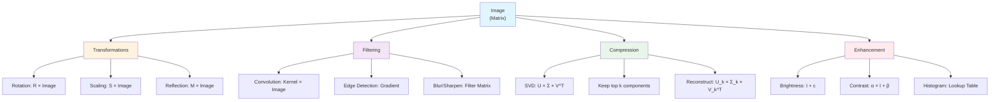

# Linear Algebra in Image Processing

## Table of Contents
1. [Introduction](#introduction)
2. [Image Representation as Matrices](#image-representation-as-matrices)
3. [Image Transformations Using Matrix Operations](#image-transformations-using-matrix-operations)
4. [Image Filtering Using Convolution](#image-filtering-using-convolution-matrix-multiplication)
5. [Image Compression Using Matrix Decomposition](#image-compression-using-matrix-decomposition)
6. [Edge Detection Using Matrix Operations](#edge-detection-using-matrix-operations)
7. [Image Enhancement Using Matrix Operations](#image-enhancement-using-matrix-operations)
8. [Color Image Processing](#color-image-processing)
9. [Summary](#summary-linear-algebra-in-image-processing)
10. [Practice Exercises](#practice-exercises)

## Introduction

Linear algebra is fundamental to image processing. Images are represented as matrices, and most image operations are matrix operations. This document demonstrates practical applications of linear algebra concepts to real image processing tasks.

**Prerequisites**: Before reading this document, make sure you understand:
- [Basic Linear Algebra](01_linear_algebra.md) - Vectors, matrices, matrix multiplication
- Matrix transformations (rotation, scaling, reflection)
- Matrix decomposition (SVD)

**Mermaid Diagram: Linear Algebra Operations in Image Processing**



## Image Representation as Matrices

**Key Concept**: Images are 2D or 3D matrices where:
- **Grayscale images**: 2D matrix (height × width), each element is a pixel intensity (0-255)
- **Color images**: 3D matrix (height × width × channels), typically RGB (3 channels)

```python
import numpy as np
import matplotlib.pyplot as plt
from PIL import Image
from scipy import ndimage

# Create a sample grayscale image (matrix)
def create_sample_image():
    """Create a simple test image as a matrix"""
    img = np.zeros((100, 100), dtype=np.uint8)
    
    # Draw geometric shapes
    # Rectangle
    img[20:60, 20:60] = 255
    
    # Circle
    y, x = np.ogrid[:100, :100]
    center_x, center_y = 70, 70
    mask = (x - center_x)**2 + (y - center_y)**2 <= 20**2
    img[mask] = 180
    
    # Diagonal line
    for i in range(100):
        if 0 <= i < 100:
            img[i, i] = 200
    
    return img

# Display image as matrix
img = create_sample_image()
print(f"Image shape (matrix dimensions): {img.shape}")
print(f"Image data type: {img.dtype}")
print(f"Pixel value range: {img.min()} to {img.max()}")
print(f"\nFirst 10x10 pixels (matrix values):")
print(img[:10, :10])

# Visualize
fig, axes = plt.subplots(1, 2, figsize=(12, 5))

axes[0].imshow(img, cmap='gray')
axes[0].set_title('Image Visualization', fontsize=14, fontweight='bold')
axes[0].axis('off')

# Show as matrix heatmap
im = axes[1].imshow(img, cmap='gray', aspect='auto')
axes[1].set_title('Image as Matrix (Pixel Values)', fontsize=14, fontweight='bold')
axes[1].set_xlabel('Width (columns)', fontsize=12)
axes[1].set_ylabel('Height (rows)', fontsize=12)
plt.colorbar(im, ax=axes[1], label='Pixel Intensity')

plt.tight_layout()
plt.savefig('docs/images/image_as_matrix.png', dpi=150, bbox_inches='tight')
plt.show()
```

## Image Transformations Using Matrix Operations

**Rotation, Scaling, Reflection, and Translation** can all be represented as matrix multiplications.

```python
def apply_rotation_matrix(image, angle_degrees):
    """Rotate image using rotation matrix"""
    angle_rad = np.radians(angle_degrees)
    # Rotation matrix
    R = np.array([[np.cos(angle_rad), -np.sin(angle_rad)],
                  [np.sin(angle_rad), np.cos(angle_rad)]])
    
    # Apply rotation using scipy (handles interpolation)
    rotated = ndimage.rotate(image, angle_degrees, reshape=False, order=1)
    return rotated, R

def apply_scaling_matrix(image, scale_x, scale_y):
    """Scale image using scaling matrix"""
    S = np.array([[scale_x, 0],
                  [0, scale_y]])
    
    # Apply scaling
    h, w = image.shape
    new_h, new_w = int(h * scale_y), int(w * scale_x)
    scaled = ndimage.zoom(image, (scale_y, scale_x), order=1)
    return scaled, S

def apply_reflection_matrix(image, axis='x'):
    """Reflect image using reflection matrix"""
    if axis == 'x':
        R = np.array([[1, 0], [0, -1]])  # Reflect across x-axis
        reflected = np.flipud(image)
    elif axis == 'y':
        R = np.array([[-1, 0], [0, 1]])  # Reflect across y-axis
        reflected = np.fliplr(image)
    else:  # y=x line
        R = np.array([[0, 1], [1, 0]])
        reflected = np.transpose(image)
    
    return reflected, R

# Create test image
img = create_sample_image()

# Apply transformations
rotated, R_rot = apply_rotation_matrix(img, 45)
scaled, S_scale = apply_scaling_matrix(img, 1.5, 1.5)
reflected_x, R_ref_x = apply_reflection_matrix(img, 'x')
reflected_y, R_ref_y = apply_reflection_matrix(img, 'y')

# Visualize transformations
fig, axes = plt.subplots(2, 3, figsize=(15, 10))

transformations = [
    ('Original', img, np.eye(2)),
    ('Rotation 45°', rotated, R_rot),
    ('Scaling 1.5x', scaled, S_scale),
    ('Reflection (x-axis)', reflected_x, R_ref_x),
    ('Reflection (y-axis)', reflected_y, R_ref_y),
]

for idx, (name, transformed_img, T) in enumerate(transformations):
    row = idx // 3
    col = idx % 3
    ax = axes[row, col]
    
    ax.imshow(transformed_img, cmap='gray')
    det = np.linalg.det(T)
    ax.set_title(f'{name}\nMatrix: {T}\nDet = {det:.2f}', 
                fontsize=11, fontweight='bold')
    ax.axis('off')

# Hide last subplot
axes[1, 2].axis('off')

plt.tight_layout()
plt.savefig('docs/images/image_transformations_linear_algebra.png', dpi=150, bbox_inches='tight')
plt.show()

print("\nKey Observations:")
print("- Rotation matrix: Preserves distances, det = 1")
print("- Scaling matrix: Changes area by det(T) factor")
print("- Reflection matrix: Reverses orientation, det = -1")
```

## Image Filtering Using Convolution (Matrix Multiplication)

**Convolution** is a fundamental image processing operation, implemented as matrix multiplication with filters/kernels.

```python
def apply_convolution_filter(image, kernel):
    """Apply convolution filter to image (edge detection, blur, etc.)"""
    # Convolution is essentially matrix multiplication with a sliding window
    filtered = ndimage.convolve(image.astype(float), kernel, mode='constant')
    return filtered.astype(np.uint8)

# Define common filters (kernels) as matrices
filters = {
    'Identity (No change)': np.array([[0, 0, 0],
                                      [0, 1, 0],
                                      [0, 0, 0]]),
    
    'Edge Detection (Sobel X)': np.array([[-1, 0, 1],
                                           [-2, 0, 2],
                                           [-1, 0, 1]]),
    
    'Edge Detection (Sobel Y)': np.array([[-1, -2, -1],
                                           [0, 0, 0],
                                           [1, 2, 1]]),
    
    'Blur (Gaussian-like)': np.array([[1, 2, 1],
                                     [2, 4, 2],
                                     [1, 2, 1]]) / 16,
    
    'Sharpen': np.array([[0, -1, 0],
                        [-1, 5, -1],
                        [0, -1, 0]]),
    
    'Emboss': np.array([[-2, -1, 0],
                       [-1, 1, 1],
                       [0, 1, 2]])
}

# Apply filters
img = create_sample_image()
results = {}

for name, kernel in filters.items():
    filtered = apply_convolution_filter(img, kernel)
    # Normalize for display
    if filtered.min() < 0:
        filtered = filtered - filtered.min()
    if filtered.max() > 255:
        filtered = (filtered / filtered.max() * 255).astype(np.uint8)
    results[name] = filtered

# Visualize
fig, axes = plt.subplots(2, 3, figsize=(15, 10))
axes = axes.flatten()

for idx, (name, filtered_img) in enumerate(results.items()):
    axes[idx].imshow(filtered_img, cmap='gray')
    axes[idx].set_title(f'{name}', fontsize=11, fontweight='bold')
    axes[idx].axis('off')

plt.tight_layout()
plt.savefig('docs/images/image_filtering_convolution.png', dpi=150, bbox_inches='tight')
plt.show()

print("\nConvolution as Matrix Operations:")
print("- Each filter is a small matrix (kernel)")
print("- Convolution = sliding window matrix multiplication")
print("- Different kernels extract different features (edges, blur, etc.)")
```

## Image Compression Using Matrix Decomposition

**Singular Value Decomposition (SVD)** can compress images by keeping only the most important components.

```python
def compress_image_svd(image, k_components):
    """Compress image using SVD (Singular Value Decomposition)"""
    # SVD: A = U × Σ × V^T
    U, s, Vt = np.linalg.svd(image.astype(float), full_matrices=False)
    
    # Keep only top k components
    U_k = U[:, :k_components]
    s_k = s[:k_components]
    Vt_k = Vt[:k_components, :]
    
    # Reconstruct: A ≈ U_k × diag(s_k) × Vt_k
    compressed = U_k @ np.diag(s_k) @ Vt_k
    
    # Calculate compression ratio
    original_size = image.size
    compressed_size = U_k.size + s_k.size + Vt_k.size
    compression_ratio = original_size / compressed_size
    
    return compressed.astype(np.uint8), compression_ratio, s

# Create a more complex test image
def create_complex_image():
    """Create image with more detail"""
    img = np.zeros((200, 200), dtype=np.uint8)
    
    # Add multiple shapes
    img[50:150, 50:150] = 255  # Large square
    img[20:80, 20:80] = 180    # Small square
    
    # Add gradient
    for i in range(200):
        img[i, :] = int(255 * i / 200)
    
    # Add circles
    y, x = np.ogrid[:200, :200]
    center_x, center_y = 100, 100
    mask = (x - center_x)**2 + (y - center_y)**2 <= 40**2
    img[mask] = 150
    
    return img

img = create_complex_image()

# Compress with different numbers of components
k_values = [5, 10, 20, 50, 100]
compressions = {}

for k in k_values:
    compressed, ratio, singular_values = compress_image_svd(img, k)
    compressions[k] = (compressed, ratio, singular_values)

# Visualize compression results
fig, axes = plt.subplots(2, 3, figsize=(15, 10))
axes = axes.flatten()

# Original
axes[0].imshow(img, cmap='gray')
axes[0].set_title(f'Original\nSize: {img.size} pixels', 
                 fontsize=11, fontweight='bold')
axes[0].axis('off')

# Compressed versions
for idx, k in enumerate(k_values, 1):
    compressed, ratio, s = compressions[k]
    axes[idx].imshow(compressed, cmap='gray')
    axes[idx].set_title(f'k={k} components\nCompression: {ratio:.2f}x\nMSE: {np.mean((img - compressed)**2):.1f}', 
                       fontsize=10, fontweight='bold')
    axes[idx].axis('off')

plt.tight_layout()
plt.savefig('docs/images/image_compression_svd.png', dpi=150, bbox_inches='tight')
plt.show()

# Plot singular values (importance)
fig, ax = plt.subplots(figsize=(10, 6))
_, _, s_full = compress_image_svd(img, min(img.shape))
ax.plot(s_full[:50], 'b-o', linewidth=2, markersize=4)
ax.set_xlabel('Component Index', fontsize=12, fontweight='bold')
ax.set_ylabel('Singular Value', fontsize=12, fontweight='bold')
ax.set_title('Singular Values (Importance of Components)', fontsize=14, fontweight='bold')
ax.grid(True, alpha=0.3)
ax.set_yscale('log')
plt.tight_layout()
plt.savefig('docs/images/singular_values_importance.png', dpi=150, bbox_inches='tight')
plt.show()

print("\nSVD Image Compression:")
print("- Images can be represented as: Image = U × Σ × V^T")
print("- Keep only top k singular values for compression")
print("- Higher k = better quality, lower compression")
print("- Lower k = more compression, lower quality")
```

## Edge Detection Using Matrix Operations

**Edge detection** uses gradient computation, which is a matrix operation.

```python
def edge_detection_sobel(image):
    """Edge detection using Sobel operators (matrix-based)"""
    # Sobel X kernel (detects vertical edges)
    sobel_x = np.array([[-1, 0, 1],
                       [-2, 0, 2],
                       [-1, 0, 1]])
    
    # Sobel Y kernel (detects horizontal edges)
    sobel_y = np.array([[-1, -2, -1],
                       [0, 0, 0],
                       [1, 2, 1]])
    
    # Apply convolution
    edges_x = ndimage.convolve(image.astype(float), sobel_x, mode='constant')
    edges_y = ndimage.convolve(image.astype(float), sobel_y, mode='constant')
    
    # Magnitude of gradient: ||∇I|| = sqrt((∂I/∂x)² + (∂I/∂y)²)
    edges_magnitude = np.sqrt(edges_x**2 + edges_y**2)
    
    # Direction of gradient: θ = atan2(∂I/∂y, ∂I/∂x)
    edges_direction = np.arctan2(edges_y, edges_x)
    
    return edges_x, edges_y, edges_magnitude, edges_direction

img = create_complex_image()
edges_x, edges_y, edges_mag, edges_dir = edge_detection_sobel(img)

# Normalize for display
edges_x_norm = ((edges_x - edges_x.min()) / (edges_x.max() - edges_x.min()) * 255).astype(np.uint8)
edges_y_norm = ((edges_y - edges_y.min()) / (edges_y.max() - edges_y.min()) * 255).astype(np.uint8)
edges_mag_norm = ((edges_mag - edges_mag.min()) / (edges_mag.max() - edges_mag.min()) * 255).astype(np.uint8)

# Visualize
fig, axes = plt.subplots(2, 2, figsize=(12, 12))

axes[0, 0].imshow(img, cmap='gray')
axes[0, 0].set_title('Original Image', fontsize=12, fontweight='bold')
axes[0, 0].axis('off')

axes[0, 1].imshow(edges_x_norm, cmap='gray')
axes[0, 1].set_title('Vertical Edges (Sobel X)\n∂I/∂x', fontsize=12, fontweight='bold')
axes[0, 1].axis('off')

axes[1, 0].imshow(edges_y_norm, cmap='gray')
axes[1, 0].set_title('Horizontal Edges (Sobel Y)\n∂I/∂y', fontsize=12, fontweight='bold')
axes[1, 0].axis('off')

axes[1, 1].imshow(edges_mag_norm, cmap='gray')
axes[1, 1].set_title('Edge Magnitude\n||∇I|| = √((∂I/∂x)² + (∂I/∂y)²)', 
                     fontsize=12, fontweight='bold')
axes[1, 1].axis('off')

plt.tight_layout()
plt.savefig('docs/images/edge_detection_matrix_operations.png', dpi=150, bbox_inches='tight')
plt.show()

print("\nEdge Detection with Linear Algebra:")
print("- Gradient = (∂I/∂x, ∂I/∂y) - a vector!")
print("- Edge magnitude = ||gradient|| = matrix norm")
print("- Edge direction = angle of gradient vector")
print("- All computed using matrix operations (convolution)")
```

## Image Enhancement Using Matrix Operations

**Enhancement operations** like brightness, contrast, and histogram equalization use matrix operations.

```python
def enhance_brightness(image, factor):
    """Adjust brightness: I_new = I + factor (matrix addition)"""
    enhanced = np.clip(image.astype(float) + factor, 0, 255).astype(np.uint8)
    return enhanced

def enhance_contrast(image, factor):
    """Adjust contrast: I_new = factor × (I - mean) + mean (matrix scaling)"""
    mean = image.mean()
    enhanced = np.clip(factor * (image.astype(float) - mean) + mean, 0, 255).astype(np.uint8)
    return enhanced

def enhance_histogram_equalization(image):
    """Histogram equalization using cumulative distribution"""
    # Compute histogram (frequency of each pixel value)
    hist, bins = np.histogram(image.flatten(), 256, [0, 256])
    
    # Cumulative distribution function (CDF)
    cdf = hist.cumsum()
    cdf_normalized = (cdf - cdf.min()) * 255 / (cdf.max() - cdf.min())
    
    # Map pixel values using CDF (lookup table = matrix transformation)
    enhanced = cdf_normalized[image].astype(np.uint8)
    return enhanced, hist, cdf

img = create_complex_image()

# Apply enhancements
bright = enhance_brightness(img, 50)
dark = enhance_brightness(img, -50)
high_contrast = enhance_contrast(img, 1.5)
low_contrast = enhance_contrast(img, 0.7)
equalized, hist, cdf = enhance_histogram_equalization(img)

# Visualize
fig, axes = plt.subplots(2, 3, figsize=(15, 10))
axes = axes.flatten()

enhancements = [
    ('Original', img),
    ('Brightness +50', bright),
    ('Brightness -50', dark),
    ('High Contrast (1.5x)', high_contrast),
    ('Low Contrast (0.7x)', low_contrast),
    ('Histogram Equalized', equalized)
]

for idx, (name, enhanced_img) in enumerate(enhancements):
    axes[idx].imshow(enhanced_img, cmap='gray')
    axes[idx].set_title(name, fontsize=11, fontweight='bold')
    axes[idx].axis('off')

plt.tight_layout()
plt.savefig('docs/images/image_enhancement_matrix_ops.png', dpi=150, bbox_inches='tight')
plt.show()

# Plot histogram and CDF
fig, axes = plt.subplots(1, 2, figsize=(14, 5))

axes[0].bar(range(256), hist, color='steelblue', alpha=0.7)
axes[0].set_xlabel('Pixel Value', fontsize=12, fontweight='bold')
axes[0].set_ylabel('Frequency', fontsize=12, fontweight='bold')
axes[0].set_title('Original Image Histogram', fontsize=14, fontweight='bold')
axes[0].grid(True, alpha=0.3)

axes[1].plot(cdf, linewidth=2, color='green')
axes[1].set_xlabel('Pixel Value', fontsize=12, fontweight='bold')
axes[1].set_ylabel('Cumulative Frequency', fontsize=12, fontweight='bold')
axes[1].set_title('Cumulative Distribution Function (CDF)', fontsize=14, fontweight='bold')
axes[1].grid(True, alpha=0.3)

plt.tight_layout()
plt.savefig('docs/images/histogram_equalization.png', dpi=150, bbox_inches='tight')
plt.show()

print("\nImage Enhancement with Linear Algebra:")
print("- Brightness: I_new = I + c (matrix addition)")
print("- Contrast: I_new = α × I + β (matrix scaling + addition)")
print("- Histogram equalization: Lookup table transformation")
print("- All are matrix/vector operations!")
```

## Color Image Processing

**Color images** are 3D matrices (height × width × channels). Each channel can be processed independently.

```python
def create_color_image():
    """Create a color test image (3D matrix)"""
    img = np.zeros((100, 100, 3), dtype=np.uint8)
    
    # Red channel
    img[20:60, 20:60, 0] = 255
    # Green channel
    img[40:80, 40:80, 1] = 255
    # Blue channel
    y, x = np.ogrid[:100, :100]
    center_x, center_y = 70, 30
    mask = (x - center_x)**2 + (y - center_y)**2 <= 15**2
    img[mask, 2] = 255
    
    return img

def convert_to_grayscale(image):
    """Convert color to grayscale: Gray = 0.299×R + 0.587×G + 0.114×B (weighted sum)"""
    # This is a matrix multiplication: [R, G, B] × [0.299, 0.587, 0.114]^T
    weights = np.array([0.299, 0.587, 0.114])
    grayscale = np.dot(image, weights).astype(np.uint8)
    return grayscale

def adjust_color_channel(image, channel, factor):
    """Adjust individual color channel (matrix scaling)"""
    adjusted = image.copy().astype(float)
    adjusted[:, :, channel] *= factor
    return np.clip(adjusted, 0, 255).astype(np.uint8)

# Create color image
color_img = create_color_image()

# Process color image
grayscale = convert_to_grayscale(color_img)
red_boost = adjust_color_channel(color_img, 0, 1.5)
green_boost = adjust_color_channel(color_img, 1, 1.5)
blue_boost = adjust_color_channel(color_img, 2, 1.5)

# Visualize
fig, axes = plt.subplots(2, 3, figsize=(15, 10))
axes = axes.flatten()

images = [
    ('Original Color', color_img),
    ('Grayscale\n(Weighted Sum)', grayscale),
    ('Red Channel Boosted', red_boost),
    ('Green Channel Boosted', green_boost),
    ('Blue Channel Boosted', blue_boost),
]

for idx, (name, img) in enumerate(images):
    if len(img.shape) == 3:
        axes[idx].imshow(img)
    else:
        axes[idx].imshow(img, cmap='gray')
    axes[idx].set_title(name, fontsize=11, fontweight='bold')
    axes[idx].axis('off')

axes[5].axis('off')

plt.tight_layout()
plt.savefig('docs/images/color_image_processing.png', dpi=150, bbox_inches='tight')
plt.show()

print("\nColor Image Processing:")
print("- Color images = 3D matrices (H × W × 3)")
print("- Each channel (R, G, B) can be processed independently")
print("- Grayscale conversion = weighted matrix multiplication")
print("- Channel adjustment = matrix scaling per channel")
```

## Summary: Linear Algebra in Image Processing

**Key Takeaways**:

1. **Images are Matrices**: Every image is a 2D or 3D matrix
2. **Transformations = Matrix Multiplication**: Rotation, scaling, reflection
3. **Filtering = Convolution**: Matrix multiplication with kernels
4. **Compression = Matrix Decomposition**: SVD for efficient storage
5. **Enhancement = Matrix Operations**: Addition, scaling, lookup tables
6. **Edge Detection = Gradient Computation**: Vector operations on matrices

**Mermaid Diagram: Linear Algebra Operations in Image Processing**


## Practice Exercises

1. **Implement image rotation from scratch** using rotation matrices (without scipy)
2. **Create custom filters** for edge detection with different kernel sizes
3. **Compress an image using SVD** and compare quality vs compression ratio for different k values
4. **Implement histogram equalization manually** step by step
5. **Apply multiple transformations in sequence** (matrix multiplication chain) and observe the result
6. **Implement color space conversion** (RGB to HSV) using matrix operations
7. **Create a simple image steganography** system using matrix operations to hide information

## Next Steps

- Review [Basic Linear Algebra](01_linear_algebra.md) for foundational concepts
- See [Applied Linear Algebra Projects - Image Transformations](projects/01_applied_linear_algebra_projects.md#project-1-image-transformations) for more advanced image processing projects
- Explore [Convolutional Neural Networks](05_cnns.md) to see how these concepts apply to deep learning

---

All visualizations are saved to `docs/images/` when you run the code examples. These graphs help visualize how linear algebra concepts apply to real image processing tasks!
