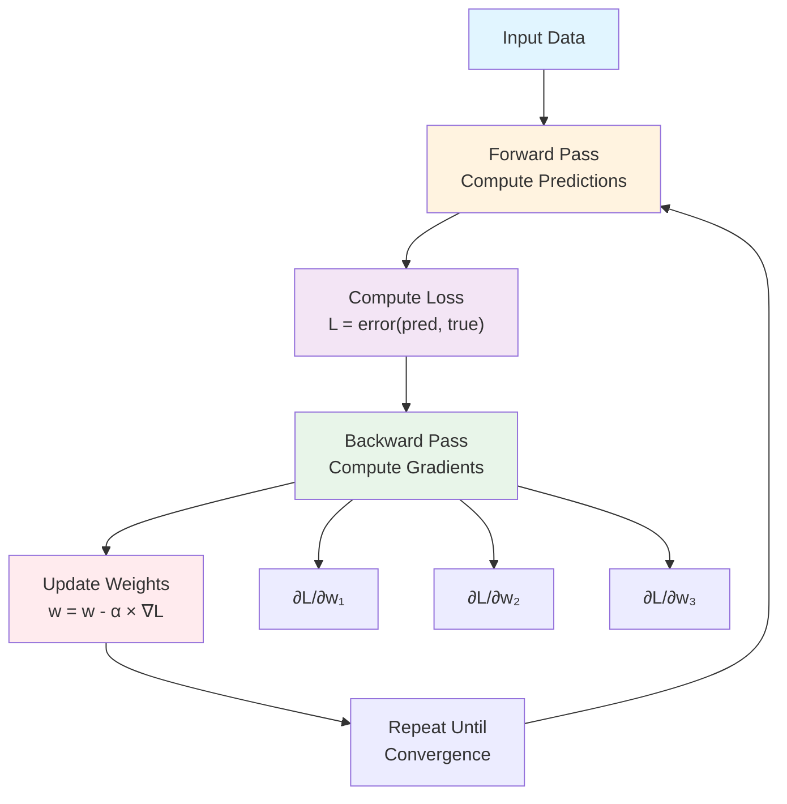

# Gradients and Gradient-Based Optimization

## Table of Contents
1. [Introduction](#introduction)
2. [What is a Gradient?](#what-is-a-gradient)
3. [Gradient Computation](#gradient-computation)
4. [Gradient Visualization](#gradient-visualization)
5. [Gradient Descent](#gradient-descent)
6. [Learning Rate](#learning-rate)
7. [Neural Network Gradients](#neural-network-gradients)
8. [Backpropagation](#backpropagation)
9. [Practice Exercises](#practice-exercises)

## Introduction

**Gradients are fundamental to deep learning.** They tell us:
- Which direction to move to increase a function (gradient direction)
- Which direction to move to decrease a function (negative gradient direction)
- How fast the function changes in each direction

**Why Gradients Matter:**
- Neural networks are trained using **gradient descent**
- Gradients enable **backpropagation** (how neural networks learn)
- Understanding gradients is essential for understanding how AI learns

**Mermaid Diagram: Gradient-Based Learning**



## What is a Gradient?

### 1D Gradient (Derivative)

For a function `f(x)`, the gradient is simply the derivative:
```
∇f = df/dx = f'(x)
```

**Geometric Meaning**: The slope of the tangent line at point x.

### 2D Gradient (Vector)

For a function `f(x, y)`, the gradient is a **vector** of partial derivatives:
```
∇f = [∂f/∂x, ∂f/∂y]
```

**Key Properties:**
- **Direction**: Points in the direction of **steepest ascent** (fastest increase)
- **Magnitude**: How fast the function increases in that direction
- **To minimize**: Move in the **opposite direction** (negative gradient)

```python
import numpy as np
import matplotlib.pyplot as plt
from src.mathematics.gradients import compute_gradient_2d, partial_derivatives_example

# Example: f(x, y) = x² + y²
def f(x, y):
    return x**2 + y**2

# Gradient at point (1, 2)
gradient = compute_gradient_2d(f, 1.0, 2.0)
print(f"Gradient at (1, 2): {gradient}")
print(f"Gradient magnitude: {np.linalg.norm(gradient):.4f}")
print(f"Gradient direction: {gradient / np.linalg.norm(gradient)}")

# Run example
partial_derivatives_example()
```

## Gradient Computation

### Numerical Gradient (Finite Differences)

When we don't have the analytical derivative, we can approximate it:

```python
from src.mathematics.gradients import compute_gradient_1d, compute_gradient_2d

def f(x):
    return x**3 - 3*x**2 + 2

# Compute gradient numerically
x = 2.0
gradient = compute_gradient_1d(f, x)
print(f"Gradient at x={x}: {gradient:.4f}")

# Analytical: f'(x) = 3x² - 6x
# At x=2: f'(2) = 3(4) - 6(2) = 12 - 12 = 0
print(f"Analytical gradient: 0.0")
```

### Analytical Gradient

For known functions, we can compute gradients analytically:

```python
# Function: f(x, y) = x² + y² + 2xy
def f(x, y):
    return x**2 + y**2 + 2*x*y

def df_dx(x, y):
    return 2*x + 2*y

def df_dy(x, y):
    return 2*y + 2*x

def gradient(x, y):
    return np.array([df_dx(x, y), df_dy(x, y)])

# At point (1, 2)
x, y = 1.0, 2.0
grad = gradient(x, y)
print(f"Gradient at ({x}, {y}): {grad}")
```

## Gradient Visualization

### Gradient Field

A gradient field shows the gradient vector at every point in space:

```python
from src.mathematics.gradients import visualize_gradient_field

# Function: f(x, y) = x² + y²
def f_2d(x, y):
    return x**2 + y**2

# Visualize gradient field
visualize_gradient_field(f_2d, save_path='docs/images/gradient_field.png')
plt.show()
```

**Interpretation:**
- Red arrows show gradient direction (points toward higher values)
- Contour lines show function values
- Arrows are perpendicular to contour lines

### Gradient Direction at a Point

```python
from src.mathematics.gradients import visualize_gradient_direction

def f(x):
    return x**2
def df(x):
    return 2*x

# Visualize gradient at x = 2
visualize_gradient_direction(f, df, point=2.0, save_path='docs/images/gradient_direction.png')
plt.show()
```

## Gradient Descent

**Gradient Descent** is the algorithm that trains neural networks. It finds the minimum of a function by:

1. Starting at a random point
2. Computing the gradient
3. Moving in the **negative gradient direction**
4. Repeating until convergence

### Algorithm

```
x_new = x_old - learning_rate × gradient
```

```python
from src.mathematics.gradients import gradient_descent_example, visualize_gradient_descent

# Run example
x_history, f_history = gradient_descent_example()

# Visualize
def f(x):
    return x**2 + 2*x + 1
def df(x):
    return 2*x + 2

visualize_gradient_descent(f, df, x_start=5.0, learning_rate=0.1, 
                          iterations=50, save_path='docs/images/gradient_descent.png')
plt.show()
```

**Key Observations:**
- Gradient descent moves toward the minimum
- Loss decreases over iterations
- Convergence depends on learning rate

### 2D Gradient Descent

```python
from src.mathematics.gradients import gradient_descent_2d

# Function: f(x, y) = x² + y² (minimum at (0, 0))
def f_2d(x, y):
    return x**2 + y**2

def df_dx(x, y):
    return 2*x

def df_dy(x, y):
    return 2*y

# Perform gradient descent
fig, x_history, y_history, f_history = gradient_descent_2d(
    f_2d, df_dx, df_dy, x_start=3.0, y_start=3.0, 
    learning_rate=0.1, iterations=30,
    save_path='docs/images/gradient_descent_2d.png'
)
plt.show()
```

## Learning Rate

The **learning rate** (α) controls step size in gradient descent:

- **Too small**: Slow convergence, may get stuck
- **Too large**: Overshoot, may diverge
- **Just right**: Fast convergence to minimum

```python
from src.mathematics.gradients import compare_learning_rates

def f(x):
    return x**2 + 2*x + 1
def df(x):
    return 2*x + 2

# Compare different learning rates
compare_learning_rates(f, df, x_start=5.0, 
                      learning_rates=[0.01, 0.1, 0.5, 1.0], 
                      iterations=30,
                      save_path='docs/images/learning_rates_comparison.png')
plt.show()
```

**Observations:**
- LR = 0.01: Very slow convergence
- LR = 0.1: Good convergence
- LR = 0.5: Fast but may overshoot
- LR = 1.0: May diverge or oscillate

## Neural Network Gradients

### Forward Pass

Compute predictions from inputs:

```python
# Simple linear model: y = w × x + b
x = 2.0
w = 1.5
b = 0.5
y_true = 5.0

y_pred = w * x + b
loss = (y_pred - y_true)**2

print(f"Input: x = {x}")
print(f"Weights: w = {w}, b = {b}")
print(f"Prediction: y = {y_pred}")
print(f"True value: {y_true}")
print(f"Loss: L = {loss}")
```

### Backward Pass (Gradients)

Compute gradients using the chain rule:

```python
from src.mathematics.gradients import neural_network_gradient_example

# Run example
dL_dw, dL_db = neural_network_gradient_example()
```

**Chain Rule:**
```
∂L/∂w = ∂L/∂y × ∂y/∂w
∂L/∂b = ∂L/∂y × ∂y/∂b
```

### Weight Update

Update weights using gradients:

```python
learning_rate = 0.1
w_new = w - learning_rate * dL_dw
b_new = b - learning_rate * dL_db

print(f"w: {w} → {w_new}")
print(f"b: {b} → {b_new}")
```

## Backpropagation

**Backpropagation** is the algorithm that computes gradients in neural networks. It uses the chain rule to propagate gradients backward from the loss to all weights.

### Computation Graph

```python
from src.mathematics.gradients import visualize_computation_graph

# Visualize computation graph and gradient flow
visualize_computation_graph(save_path='docs/images/computation_graph.png')
plt.show()
```

**Key Concepts:**
- **Forward pass**: Compute predictions (black arrows)
- **Backward pass**: Compute gradients (red arrows)
- **Chain rule**: Multiply gradients along the path

### Example: Multi-Layer Network

```python
# Two-layer network: y = w2 × (w1 × x + b1) + b2
x = 2.0
w1, b1 = 1.0, 0.5
w2, b2 = 1.5, 0.3
y_true = 5.0

# Forward pass
z1 = w1 * x + b1
y_pred = w2 * z1 + b2
loss = (y_pred - y_true)**2

# Backward pass
dL_dy = 2 * (y_pred - y_true)
dL_dw2 = dL_dy * z1
dL_db2 = dL_dy * 1
dL_dz1 = dL_dy * w2
dL_dw1 = dL_dz1 * x
dL_db1 = dL_dz1 * 1

print("Gradients:")
print(f"  ∂L/∂w2 = {dL_dw2}")
print(f"  ∂L/∂b2 = {dL_db2}")
print(f"  ∂L/∂w1 = {dL_dw1}")
print(f"  ∂L/∂b1 = {dL_db1}")
```

## Practice Exercises

1. **Compute gradients manually** for f(x) = x³ - 3x² + 2x
2. **Implement gradient descent** from scratch for a 2D function
3. **Compare learning rates** for different functions
4. **Visualize gradient fields** for different 2D functions
5. **Implement backpropagation** for a 3-layer neural network
6. **Study gradient clipping** (preventing exploding gradients)
7. **Explore adaptive learning rates** (Adam, RMSprop)

## Summary

**Key Takeaways:**

1. **Gradient = Direction of steepest ascent**
2. **Gradient Descent = Move in negative gradient direction**
3. **Learning Rate = Controls step size**
4. **Backpropagation = Chain rule for computing gradients**
5. **Gradients enable neural networks to learn**

**Next Steps:**

- Study [Calculus Fundamentals](02_calculus.md) for derivatives
- Explore [Neural Networks](04_neural_networks.md) to see gradients in action
- Practice with [Gradient Notebook](../notebooks/gradient_examples.ipynb)

---

All visualizations are saved to `docs/images/` when you run the code examples!
